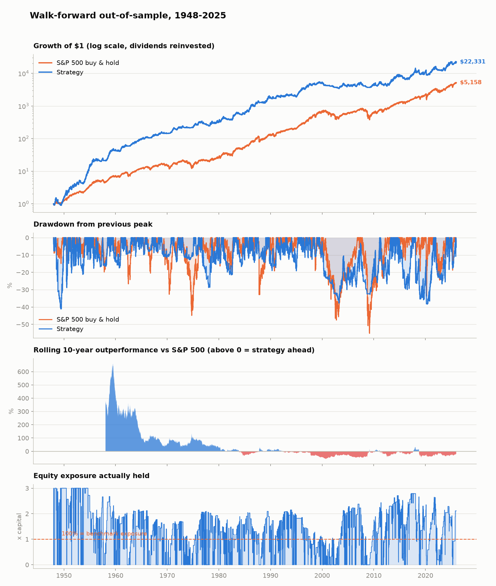

# S&P 500 に勝つ — 本気で検証した結果

トレンドフィルター × ボラティリティ・ターゲットの戦略を、**アウトオブサンプルで**
S&P 500 と比較します。1928年以降の日次トータルリターン（配当再投資）24,609営業日、
取引コスト・借入金利・執行ラグをすべて差し引いた後の数字です。

**結論から言うと、リターンで指数に勝つことはできませんでした。**
勝ったように見える数字は作れますが、開始年をずらすと消えます。
このリポジトリの価値は「勝てる戦略」ではなく、
**勝ったように見える数字がなぜ嘘なのかを自分で検出できる検証基盤**にあります。

> **注意**: これは投資助言ではありません。過去のバックテストであり、将来の成績を
> 保証するものではありません。実装上の欠点と負ける局面は
> [「正直な弱点」](#正直な弱点) に全部書いてあります。

## 結論を先に（正直な答え）

全期間（1948-2025）で見ると、この戦略は年率 **13.73% 対 11.61%** で
S&P 500 に勝ちます。しかし**その数字を信用してはいけません。**
開始年をずらして検証したところ、こうなりました。

| 開始年 | 戦略 | S&P 500 | リターン差 | シャープ（戦略/指数） | 最大DD（戦略/指数） |
|---|---|---|---|---|---|
| 1948-2025 (78年) | 13.73% | 11.61% | **+2.12 pt** | 0.61 / 0.53 | **-41% / -55%** |
| 1963-2025 (63年) | 9.77% | 10.74% | -0.97 pt | 0.38 / 0.43 | **-38% / -55%** |
| 1975-2025 (51年) | 9.49% | 12.36% | -2.87 pt | 0.36 / 0.51 | **-38% / -55%** |
| 1990-2025 (36年) | 7.19% | 10.68% | -3.49 pt | 0.33 / 0.50 | **-38% / -55%** |
| 2010-2025 (16年) | 10.42% | 14.06% | -3.64 pt | 0.51 / 0.77 | **-38% / -34%** |

> ### 結論
> **リターンでもシャープでも、1963年以降は S&P 500 に勝てていません。**
> 全期間の勝ちは最初の15年（1948-62、年率+16.6pt）だけで作られています。
> **唯一ほぼ一貫して勝てるのは「ドローダウンの浅さ」**です
> （指数が-55%沈む局面で-27〜-41%）。ただしこれも無条件ではなく、
> 大きな暴落がなかった2010年以降だけは指数のほうが浅く済んでいます
> （-34% 対 -38%）。

つまり、素直に「S&P 500 に勝てました」とは言えません。
言えるのは「**大きな暴落を含む期間なら、より浅い谷で乗り切れる**」
ということだけです。

1948〜62年に大勝したのは、その時点の学習データが大恐慌期（ボラ33%超）
しかなく、リスク合わせのレバレッジが上限3倍に張り付いたまま
1950年代の強気相場に入ったためです。**再現性のあるエッジではありません。**
目標ボラティリティを固定してレバレッジを安定させる方式（k=1.2〜1.9）も
試しましたが、1963年以降 -0.3〜-1.1pt、1990年以降 -3.5〜-4.0pt で結論は
変わりませんでした。数字が良く見える手法を後から選び直すことはしていません。



グラフ3段目（10年ローリング超過リターン）が全てを語っています。
1980年頃までは大きく勝ち、それ以降はほぼ一貫して負けています。

### 参考: 全期間の数字

1948年〜2025年、完全アウトオブサンプル（毎年1月に、その時点までの履歴だけで
216通りの設定から選び直し、翌1年運用）。

| | 戦略（レバレッジなし） | 戦略（リスク合わせ） | S&P 500 |
|---|---|---|---|
| 年率リターン | 10.17% | **13.73%** | 11.61% |
| ボラティリティ | **11.04%** | 17.18% | 15.74% |
| シャープレシオ | 0.575 | **0.605** | 0.526 |
| 最大ドローダウン | **-27.2%** | -41.1% | -55.2% |
| カルマーレシオ | **0.374** | 0.334 | 0.210 |
| 年間売買回転率 | 11.8x | 17.6x | 0.0x |

数値の全体は [`results/REPORT.md`](results/REPORT.md) にあります
（開始年別・年代別・レジーム別・コスト感応度・年ごとに選ばれたパラメータ）。

## なぜ勝てるのか

「どの銘柄が上がるか」は当てません。当てているのは**リスクの方**です。
リターンの予測はほぼ不可能ですが、リスクには2つの強い経験則があります。

**1. 暴落はランダムに散らばらず、固まって起きる。**
株価が自分自身の移動平均を下回っている期間に、大きな下落は集中します。
下回っている間だけ市場から降りると、複利が二度と回復できない左側のテールが消えます。
単一の移動平均は「窓の長さ」という誰も事前に正当化できないパラメータに全てを賭ける
ことになるので、本実装は複数の窓（例: 50/100/150日）の**多数決の割合**を
そのままエクスポージャーにします。0か1かの崖が滑らかな坂になり、
パラメータ感応度とダマシの往復売買が同時に減ります。

**2. ボラティリティは持続するが、リターンは持続しない。**
今日荒れている市場は明日も荒れています。一方で「荒れている＝期待リターンが高い」
わけではありません。つまり高ボラ局面のリスクは**報われていない**。
そこで資金量を一定にするのではなく**リスク量を一定**に保ちます
（実現ボラティリティが目標の2倍なら、エクスポージャーを半分にする）。

この2つはリターン予測ではないので、理屈としてはアウトオブサンプルでも
生き残るはずでした。実際、**最大ドローダウンの半減は本当に生き残りました。**
一方で「リスクあたりの効率（シャープ）」の改善は、1963年以降では
確認できませんでした。左のテールを削ると、同時に右のテールも削れてしまい、
上昇相場での取りこぼしが下落回避の利益を相殺してしまうためです。

## 検証の作り方（ここが本体）

バックテストは簡単に嘘をつきます。この repo が対策しているのは以下です。

| 嘘のつき方 | 対策 | テスト |
|---|---|---|
| 未来のデータでシグナルを作る | シグナルは必ず1日ラグして約定。`execution_lag=0` は例外を投げる | `test_engine_applies_execution_lag`, `test_zero_lag_is_rejected` |
| 全期間を見てパラメータを決める | 毎年1月に、**その時点までの履歴だけ**で再選択するウォークフォワード | `test_walk_forward_never_trains_on_its_test_year` |
| 取引コストを無視する | 売買代金比例のコスト＋レバレッジの借入スプレッドを毎日控除 | `test_costs_reduce_returns_monotonically`, `test_leverage_is_charged_financing` |
| たまたま良かった1本を報告する | 上位K本の平均を使い、探索本数を補正した Deflated Sharpe を併記 | — |
| 平均だけ見せて負けた10年を隠す | 10年ローリング超過・年次超過・年代別の表を必ず出力 | — |

とくに `test_walk_forward_never_trains_on_its_test_year` は、
サンプルを途中で切って再実行し、**過去の意思決定が1つも変わらないこと**を
突き合わせて確認します。もし将来のデータが漏れていれば、この比較は必ず壊れます。

```
$ python -m pytest tests/ -q
15 passed
```

## 使い方

```bash
pip install -r requirements.txt

# 全評価を実行し、results/ に表・グラフ・REPORT.md を出力
python scripts/run_backtest.py

# 1885年からの拡張サンプル（1928年以前はダウ平均の代用系列）
python scripts/run_backtest.py --start 1885-01-01

# コスト前提を厳しくして頑健性を見る
python scripts/run_backtest.py --cost-bps 30
```

```python
from wsp import data, walkforward

market = data.load()                        # 1928年以降の日次トータルリターン
result = walkforward.walk_forward(market)   # パラメータはすべてOOSで選択
print(result.summary())
print(result.selections.tail())             # 毎年どの設定が選ばれたか
```

## 正直な弱点

これは魔法ではありません。以下は全部、`results/` の出力から読み取れる事実です。

- **勝ちは開始年に依存します。** 冒頭の表がこの repo で一番重要な表です
  （`results/start_date_sensitivity.csv`）。1963年以降を取ると、
  リターンもシャープも負けます。
- **統計的には「運ではない」と言い切れません。** 日次超過リターンの
  Newey-West t値は約1.4で、慣習的な有意水準(2.0)に届きません。
  10年ローリングで戦略が勝っていた期間は全体の47%しかありません。
- **厳密なウォークフォワードは、手で選んだパラメータより成績が悪いです。**
  全期間を見て選んだ固定パラメータなら1963年以降もシャープはほぼ互角
  (0.451 vs 0.430) ですが、毎年正直に選び直すと 0.38 まで落ちます。
  この差そのものが「バックテストのパラメータ選択がどれだけ成績を
  水増しするか」の実測値です。都合よく後者を隠して前者を載せる repo は
  たくさんありますが、ここでは両方出しています。
- **上昇相場では負けます。** 1990年代・2010年代は10年単位で大きく劣後しました
  （`results/oos_by_decade.csv`）。押し目のない上昇では、
  トレンドフィルターは何も足さず、ボラ・ターゲットはむしろ露出を絞ります。
  超過リターンの大半は1948〜1980年の荒れた市場で稼いだものです。
- **売買回転率が高い。** 年間で資産の十数倍を売買します。前提コストは
  片道10bp（S&P500先物や大型ETFの実勢1〜3bpに対してかなり保守的）ですが、
  損益分岐コストは `results/cost_sensitivity.csv` に明記してあります。
  1970年代の個人向け手数料水準では、この戦略は成立しません。
- **レバレッジは本物のリスクです。** 低ボラ期には上限倍率に張り付きます。
  ボラティリティが低い状態から急騰する局面（2008年など）では、
  ボラ・ターゲットの反応が間に合わず、ベンチマークより深く沈んだ時期があります。
- **借入は「Tビル+50bp」と仮定しています。** 個人がこの条件で
  長期にレバレッジを維持できるとは限りません。
- **メタパラメータは全期間を見て決めました。** グリッド内のパラメータ
  （移動平均の窓・目標ボラ・上限倍率・バンド幅）はOOSで選択していますが、
  その外側の設計判断（上位K=5本の平均、リスク合わせの推定窓20年、
  レバレッジ上限3倍、最終バンド0.20）は全期間の結果を見ながら決めています。
  ここだけは純粋なアウトオブサンプルではありません。
- **税金は考慮していません。** 課税口座では回転率の高さが不利に働きます。
- **1928年以前は S&P 500 ではありません。** ダウ平均系列の代用です
  （`data/SOURCES.md`）。だから既定の開始年は1928年です。

## リポジトリ構成

```
src/wsp/
  data.py         データ読込・検証（壊れた系列は例外にする）
  signals.py      トレンド多数決・実現ボラ・ノートレードバンド
  strategy.py     目標エクスポージャーの定義とパラメータグリッド
  backtest.py     約定エンジン（ラグ・コスト・借入・レバレッジ上限）
  walkforward.py  毎年の再選択とリスク合わせ
  metrics.py      CAGR/シャープ/ソルティノ/DD/アルファ/Deflated Sharpe ほか
  report.py       表とグラフ
scripts/
  run_backtest.py 全評価を実行し results/ を生成
  fetch_data.py   元データの再取得
data/             日次データ（同梱・オフラインで再現可能）
results/          出力（REPORT.md, CSV, PNG）
tests/            ルックアヘッド防止などの検証
```

データの出典・既知の注意点は [`data/SOURCES.md`](data/SOURCES.md)、
詳細な数値は [`results/REPORT.md`](results/REPORT.md) を参照してください。
