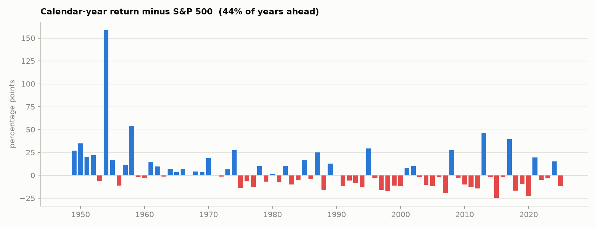

# Results

Sample **1928-01-03 - 2025-12-19**, daily total returns
(dividends reinvested). Costs: 10bp per unit of turnover,
50bp annual borrowing premium over the Treasury-bill rate,
one-day execution lag, leverage capped at 3x.

## Headline

Out of sample, from **1948-01-02 to 2025-12-19**, with every
parameter chosen before the returns it earned:

> Read this table together with the start-date section below it. The full-sample
> CAGR comparison is the least robust number on this page; the risk columns are
> the most robust.

| | Strategy | S&P 500 | Difference |
|---|---|---|---|
| Annual return (CAGR) | **13.73%** | 11.61% | **+2.12 pts** |
| Volatility | 17.18% | 15.74% | +1.45 pts |
| Sharpe ratio | **0.605** | 0.526 | +0.080 |
| Worst drawdown | -41.1% | -55.2% | +14.1 pts |
| Calmar | 0.334 | 0.210 | +0.124 |

Annualised alpha **4.60%** at beta **0.70**.
The deflated-Sharpe probability that the true Sharpe is positive, after correcting
for having searched 216 configurations, is **1.000**.

Two numbers argue against reading too much into the headline, and both belong here:

- The Newey-West t-statistic on the daily return difference is **1.42**.
  That is **below** the conventional 2.0 bar, so the return difference alone is not statistically distinguishable from luck over this sample. The risk-side results - drawdown and Calmar - are the more robust claim.
- The strategy was ahead in only **47%** of rolling
  ten-year windows. An edge that shows up in the full-sample CAGR but in fewer
  than half of ten-year windows is a *concentrated* edge, not a steady one - it
  is earned in a handful of turbulent stretches and given back slowly in calm
  ones. An investor who started at the wrong time would have waited a long while.


## Does the edge survive a later start date?

**The headline does not survive.** The full-sample excess of +2.12 pts/yr comes entirely from the earliest window: from 1963 onward the strategy *underperforms* the index on raw return at every starting point tested (-3.64 to -0.97 pts/yr). Read the CAGR comparison as a statement about one historical stretch, not a repeatable edge. What does survive is the risk side - see the Sharpe and drawdown columns, and the unlevered table below.

Risk-matched (levered) walk-forward:

| from      |   years |   strategy CAGR % |   S&P 500 CAGR % |   excess % |   strategy Sharpe |   S&P 500 Sharpe |   strategy MaxDD % |   S&P 500 MaxDD % |
|:----------|--------:|------------------:|-----------------:|-----------:|------------------:|-----------------:|-------------------:|------------------:|
| 1948-2025 |      78 |             13.73 |            11.61 |       2.12 |              0.61 |             0.53 |             -41.08 |            -55.19 |
| 1963-2025 |      63 |              9.77 |            10.74 |      -0.97 |              0.38 |             0.43 |             -38.34 |            -55.19 |
| 1975-2025 |      51 |              9.49 |            12.36 |      -2.87 |              0.36 |             0.51 |             -38.34 |            -55.19 |
| 1990-2025 |      36 |              7.19 |            10.68 |      -3.49 |              0.33 |             0.5  |             -38.34 |            -55.19 |
| 2000-2025 |      26 |              5.65 |             8    |      -2.36 |              0.29 |             0.4  |             -38.34 |            -55.19 |
| 2010-2025 |      16 |             10.42 |            14.06 |      -3.64 |              0.51 |             0.77 |             -38.34 |            -33.72 |

Unlevered walk-forward, same out-of-sample years:

| from      |   years |   strategy CAGR % |   S&P 500 CAGR % |   excess % |   strategy Sharpe |   S&P 500 Sharpe |   strategy MaxDD % |   S&P 500 MaxDD % |
|:----------|--------:|------------------:|-----------------:|-----------:|------------------:|-----------------:|-------------------:|------------------:|
| 1948-2025 |      78 |             10.17 |            11.61 |      -1.43 |              0.57 |             0.53 |             -27.24 |            -55.19 |
| 1963-2025 |      63 |              8.54 |            10.74 |      -2.2  |              0.39 |             0.43 |             -27.24 |            -55.19 |
| 1975-2025 |      51 |              8.1  |            12.36 |      -4.26 |              0.36 |             0.51 |             -27.24 |            -55.19 |
| 1990-2025 |      36 |              5.89 |            10.68 |      -4.79 |              0.32 |             0.5  |             -27.24 |            -55.19 |
| 2000-2025 |      26 |              4.18 |             8    |      -3.82 |              0.26 |             0.4  |             -25.57 |            -55.19 |
| 2010-2025 |      16 |              7.24 |            14.06 |      -6.81 |              0.53 |             0.77 |             -22.18 |            -33.72 |

## All variants

|                                           |   CAGR % |   Vol % |   Sharpe |   Sortino |   MaxDD % |   Calmar |   Ulcer % |   TimeUnderWater % |   Turnover x/yr |   Alpha % |   Beta |   ExcessCAGR % |   t-stat |   DeflatedSharpe p |   Rolling10yWin % |
|:------------------------------------------|---------:|--------:|---------:|----------:|----------:|---------:|----------:|-------------------:|----------------:|----------:|-------:|---------------:|---------:|-------------------:|------------------:|
| S&P 500 buy & hold                        |    10.17 |   18.66 |     0.44 |      0.62 |    -83.65 |     0.12 |     20.78 |              90.87 |            0.01 |    nan    | nan    |         nan    |   nan    |                nan |            nan    |
| Trend only (no vol target)                |     9.67 |   11.59 |     0.57 |      0.81 |    -42.38 |     0.23 |     10.78 |              90.21 |            6.29 |      3.13 |   0.43 |          -0.5  |    -1.18 |                nan |            nan    |
| Trend x vol target (in-sample params)     |    11.47 |   13.79 |     0.62 |      0.86 |    -36.32 |     0.32 |     12.33 |              91.98 |            8.05 |      4.88 |   0.45 |           1.3  |     0.26 |                nan |            nan    |
| ... levered to benchmark risk             |    13.42 |   17.93 |     0.61 |      0.85 |    -44.83 |     0.3  |     16.52 |              92.69 |           10.82 |      6.19 |   0.58 |           3.25 |     1.69 |                nan |            nan    |
| WALK-FORWARD out-of-sample (unlevered)    |    10.17 |   11.04 |     0.57 |      0.8  |    -27.24 |     0.37 |      9.43 |              92.51 |           11.79 |      2.54 |   0.46 |          -1.43 |    -1.67 |                  1 |             41.52 |
| WALK-FORWARD out-of-sample (risk-matched) |    13.73 |   17.18 |     0.61 |      0.83 |    -41.08 |     0.33 |     15.05 |              93.42 |           17.61 |      4.6  |   0.7  |           2.12 |     1.42 |                  1 |             46.79 |
| S&P 500 over the same OOS window          |    11.61 |   15.74 |     0.53 |      0.74 |    -55.19 |     0.21 |     11.74 |              89.33 |            0.01 |    nan    | nan    |         nan    |   nan    |                nan |            nan    |

## Out-of-sample by decade

The average hides the pattern that matters: this approach wins in choppy and
falling markets and gives ground in sustained melt-ups.

| period   |   strategy CAGR % |   benchmark CAGR % |   excess % |   strategy vol % |   benchmark vol % |   strategy MaxDD % |   benchmark MaxDD % |
|:---------|------------------:|-------------------:|-----------:|-----------------:|------------------:|-------------------:|--------------------:|
| 1940s    |             24.21 |              12    |      12.21 |            26.74 |             12.94 |             -41.08 |              -14.94 |
| 1950s    |             40.52 |              19.3  |      21.21 |            22.16 |             11.17 |             -28.87 |              -19.81 |
| 1960s    |             12.31 |               7.83 |       4.49 |             9.77 |              9.91 |             -12.8  |              -26.65 |
| 1970s    |              8.62 |               5.76 |       2.86 |            11.84 |             13.54 |             -28.75 |              -44.86 |
| 1980s    |             18.71 |              17.41 |       1.3  |            17.12 |             17.05 |             -21.5  |              -32.89 |
| 1990s    |             11.3  |              17.92 |      -6.62 |            15.72 |             14.85 |             -19.17 |              -19.18 |
| 2000s    |             -1.55 |              -1.01 |      -0.54 |            13.95 |             22.44 |             -35.65 |              -55.19 |
| 2010s    |              9.43 |              13.46 |      -4.03 |            21    |             14.7  |             -35.89 |              -19.35 |
| 2020s    |             12.09 |              15.07 |      -2.98 |            20.61 |             20.79 |             -29.29 |              -33.72 |



## By regime

| period                  |   strategy CAGR % |   benchmark CAGR % |   excess % |   strategy vol % |   benchmark vol % |   strategy MaxDD % |   benchmark MaxDD % |
|:------------------------|------------------:|-------------------:|-----------:|-----------------:|------------------:|-------------------:|--------------------:|
| 1928-1949 Crash & war   |             24.21 |              12    |      12.21 |            26.74 |             12.94 |             -41.08 |              -14.94 |
| 1950-1972 Post-war boom |             24.66 |              13.26 |      11.4  |            16.36 |             10.69 |             -28.87 |              -32.66 |
| 1973-1982 Stagflation   |              7.92 |               6.64 |       1.27 |            14.12 |             14.88 |             -28.75 |              -44.86 |
| 1983-1999 Great bull    |             14.84 |              18.1  |      -3.26 |            16.34 |             15.97 |             -19.17 |              -32.89 |
| 2000-2012 Lost decade   |             -1.55 |               1.6  |      -3.15 |            15.04 |             21.57 |             -35.65 |              -55.19 |
| 2013-2025 QE & AI bull  |             13.38 |              14.82 |      -1.44 |            21.42 |             16.95 |             -38.34 |              -33.72 |

## How much friction the edge can absorb

The strategy trades 17.6x its capital per year, so
costs are the assumption most likely to overturn the result. The edge survives
up to **21 bps per unit of turnover**, against roughly 1-3 bps for
S&P 500 futures or a liquid ETF today.

|   cost bps |   CAGR % |   Sharpe |   excess vs S&P % |
|-----------:|---------:|---------:|------------------:|
|          0 |   15.749 |    0.708 |             4.141 |
|          5 |   14.735 |    0.656 |             3.127 |
|         10 |   13.729 |    0.605 |             2.121 |
|         20 |   11.743 |    0.503 |             0.135 |
|         30 |    9.791 |    0.4   |            -1.817 |
|         50 |    5.983 |    0.195 |            -5.625 |

## Which parameters the walk-forward chose

Selection is stable - it keeps landing in the same neighbourhood rather than
chasing a different configuration every year, which is what fitting noise looks
like.

| parameter    | most_common   |   share % |   distinct_values |
|:-------------|:--------------|----------:|------------------:|
| trend_family | fast          |      85.9 |                 2 |
| target_vol   | 0.15          |      52.6 |                 2 |
| max_exposure | 1.5           |     100   |                 1 |
| vol_window   | 120           |     100   |                 1 |
| band         | 0.2           |      65.4 |                 2 |

## Reproduce

```bash
pip install -r requirements.txt
python scripts/run_backtest.py --start 1928-01-01
```
