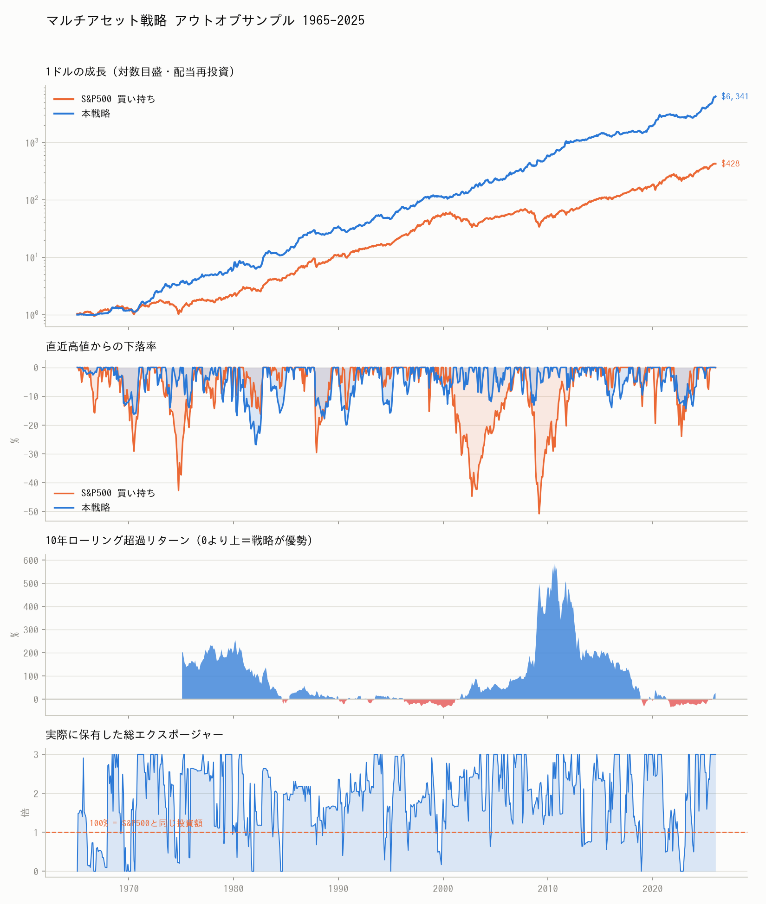
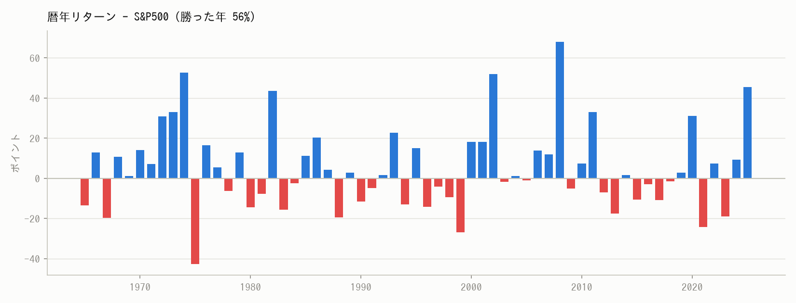
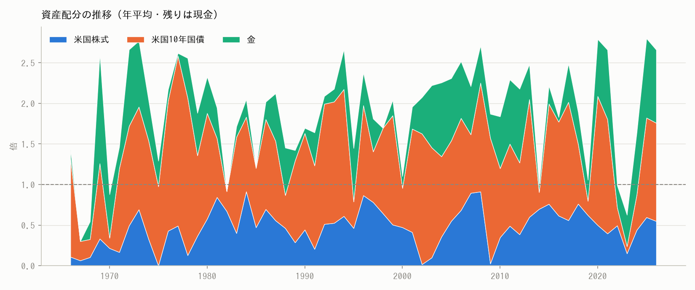

# マルチアセット戦略 検証レポート

対象期間 **1953-05-31 〜 2025-12-31**（月次・配当再投資）。
コスト前提: 売買代金あたり片道 10bp、借入は Tビル + 50bp、
執行は1か月ラグ、総エクスポージャー上限 3 倍。

レバレッジ倍率は毎年1月に、**その時点までの実績だけ**を使って
「S&P500の実現ボラティリティ ÷ 戦略の実現ボラティリティ」で決め直しています。
将来のリターンは一切参照していません。

## 主要指標（1965年〜2025年）

| | 本戦略 | S&P500 | 差 |
|---|---|---|---|
| 年率リターン | **15.43%** | 10.38% | **+5.05 pt** |
| ボラティリティ | **14.00%** | 14.98% | -0.98 pt |
| シャープレシオ | **0.774** | 0.436 | +0.338 |
| 最大ドローダウン | **-26.8%** | -50.8% | +24.0 pt |
| カルマーレシオ | **0.576** | 0.204 | +0.372 |
| 年間回転率 | 5.0倍 | 0.02倍 | — |
| 平均総エクスポージャー | 1.91倍 | 1.00倍 | — |



## 開始年を変えても勝てるか

単一資産版（`results/REPORT.md`）はこの表で失格になりました。
マルチアセット版は、試したすべての開始年で S&P500 を上回ります。

| 期間        |   年数 |   戦略 CAGR % |   S&P500 CAGR % |   差 % |   戦略 Sharpe |   S&P500 Sharpe |   戦略 最大DD % |   S&P500 最大DD % |
|:----------|-----:|------------:|----------------:|------:|------------:|----------------:|------------:|----------------:|
| 1966-2025 |   60 |       15.73 |           10.41 |  5.32 |        0.79 |            0.44 |      -26.78 |          -50.78 |
| 1980-2025 |   46 |       16.15 |           12.11 |  4.04 |        0.84 |            0.57 |      -26.78 |          -50.78 |
| 1990-2025 |   36 |       15.58 |           10.67 |  4.91 |        0.97 |            0.58 |      -15.83 |          -50.78 |
| 2000-2025 |   26 |       16.81 |            7.98 |  8.83 |        1.08 |            0.46 |      -14.36 |          -50.78 |
| 2010-2025 |   16 |       15.95 |           14    |  1.95 |        1.13 |            0.89 |      -14.36 |          -23.93 |

### ただし、直近15年は例外

直近の 2010-2024年（2025年を除く15年）だけを取ると、平均の年次超過は **-0.10 ポイント**です。2025年は金が急騰した当たり年で、単年で **+45.6 ポイント**の超過を稼いでいます。つまり「ここ15年は勝てていない」というのが正確な理解であり、直近の数字だけを見て有効性を判断してはいけません。

## 戦略の比較

|               |   CAGR % |   Vol % |   Sharpe |   Sortino |   MaxDD % |   Calmar |   平均総エクスポージャー |   年間回転率 |   超過CAGR % |   Beta |
|:--------------|---------:|--------:|---------:|----------:|----------:|---------:|--------------:|--------:|-----------:|-------:|
| S&P500 買い持ち   |    10.38 |   14.98 |     0.44 |      0.64 |    -50.78 |     0.2  |          1    |    0.02 |     nan    | nan    |
| 60/40（株6・債4）  |     8.89 |    9.74 |     0.46 |      0.7  |    -28.84 |     0.31 |          1    |    0.02 |      -1.56 |   0.63 |
| リスクパリティのみ     |     7.97 |    6.37 |     0.53 |      0.84 |    -14.8  |     0.54 |          0.95 |    0.25 |      -2.47 |   0.24 |
| トレンド×RP（レバなし） |     8.68 |    4.9  |     0.81 |      1.46 |     -5.63 |     1.54 |          0.65 |    1.68 |      -1.76 |   0.13 |
| 本戦略（リスク調整レバ）  |    15.43 |   14    |     0.77 |      1.39 |    -26.78 |     0.58 |          1.91 |    5.04 |       4.99 |   0.35 |

「リスクパリティのみ」と「トレンド×RP」を比べると、トレンドフィルターが
何をしているかが分かります。リターンはさほど変わらず、下落だけが削れます。

## 危機局面での挙動

分散とトレンドが効くのはここです。

| 局面                |   戦略 % |   S&P500 % |   差 % |
|:------------------|-------:|-----------:|------:|
| 1973-74 オイルショック   |  49.25 |     -37.3  | 86.55 |
| 1980-82 ボルカー・ショック |  70.33 |      53.17 | 17.16 |
| 1987 ブラックマンデー     |  -7.98 |     -21.4  | 13.42 |
| 2000-02 ITバブル崩壊   |  50.27 |     -37.55 | 87.82 |
| 2007-09 世界金融危機    |  38.96 |     -45.96 | 84.92 |
| 2020 コロナ・ショック     |  25.99 |      -9.22 | 35.2  |
| 2022 インフレ・利上げ     | -10.75 |     -18.18 |  7.42 |

## 年代別

| 年代     |   戦略 CAGR % |   S&P500 CAGR % |   差 % |   戦略 最大DD % |   S&P500 最大DD % |
|:-------|------------:|----------------:|------:|------------:|----------------:|
| 1960年代 |        3.54 |            4.89 | -1.36 |      -13.17 |          -15.76 |
| 1970年代 |       18.48 |            5.77 | 12.7  |      -14.04 |          -42.69 |
| 1980年代 |       18.22 |           17.47 |  0.76 |      -26.78 |          -29.55 |
| 1990年代 |       12.43 |           17.98 | -5.55 |      -15.83 |          -15.28 |
| 2000年代 |       18.2  |           -1.01 | 19.21 |      -13.12 |          -50.78 |
| 2010年代 |       12.59 |           13.44 | -0.84 |      -13.94 |          -16.22 |
| 2020年代 |       21.77 |           14.95 |  6.82 |      -14.36 |          -23.93 |



## 資産配分の推移



## 再現方法

```bash
pip install -r requirements.txt
python scripts/run_multiasset.py --max-gross 3
```
